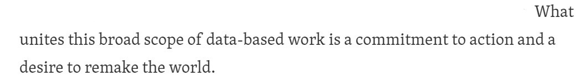
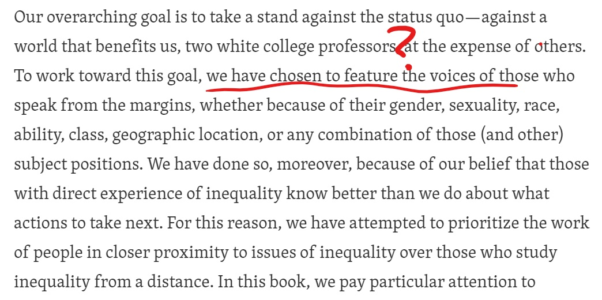
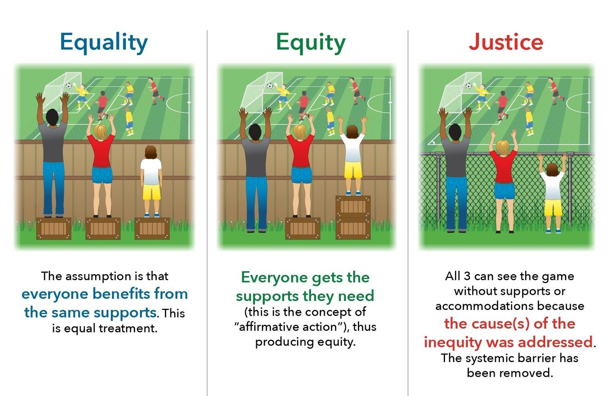

After reading half of the intro of *Data Feminism*, I found myself *enraged* by what the authors brought up, which is definitely very important, but more so by what the authors failed to do and mention. 

***

#### **Implicit Racism?**

* Christine Darten surely was exceptional, both as a professional and as an activist. However, she was represented as a almost perfect model - motivated, confident, intelligent, progressive, persistent, etc., as if only the most educated and resourceful members of the minority are contributing to activism. When she presented the data along with her extraordinary skills, she shook the assumption that women are less capable, but also sent the message that women needed to be extra good to be respected, or had to carry the baggage as representing the whole female community. The authors should at least acknowledge activism is not solely by the educated. They also failed to mention how Darten's use of data relates to her race, as if the story of a black woman would sound more compelling than the same gesture of a white woman. If not, why didn't they describe how were black women treated? Did they expect readers to have knowledge of racial oppression but not of gender oppression?

***

#### **Commitment to Action?** 
{width=50%}

* The two authors mentioned their privileged identities and the bias they might have, but they could also easily have other intellectuals who didn't have such a smooth path in their book-writing. Why didn't they think of having a black person, a gender non-conforming person, or a person with less 'formal' education, etc., to be a co-author? People whose lives were once on the line with representations of data? How hard would that be? Is it that these people didn't exist or the authors didn't even think of being advocates in action? Did they think this is not their responsibility? Did they realize they had the power to 'feature' some people' voices as they saw fit? How can I believe they sincerely believe in what they wrote, or did so because that is what seemed progressive or some other characteristics they wanted, maybe unconsciously, others to perceive them as? Maybe they had done something similar or mentioned it elsewhere, so I went through the chapters and found they were the only authors for all. Well, at least they proved their own point - feminism has been dominated by white elites.

{width=50%}

***

#### **About Feminism and Equality**

* At various points, the authors gave reasons for their choice of book title and how it's about power, not gender. However,

* [**Feminism** aims for equality for the sexes, not gender.](https://en.wikipedia.org/wiki/Feminism) I know, it's sad.

* [**Gender equality**, by definition](https://en.wikipedia.org/wiki/Gender_equality), or known publicly, doesn't include gender minorities. What a surprise.

* Feminism aims for **equality**. While there are still [laws](https://www.aclu.org/legislation-affecting-lgbt-rights-across-country) that do not protect transgender people's basic human rights in the United States, equality would not be sufficient. Again, sad.

{width=70%}  

* **Language** For example, Black Lives Matter is more about inequality than the color of skin, but is it appropriate to say it reflects the struggles of all races? If the authors had trouble thinking of better words that pertain to social power, here are some suggestions: tools of institutionalization, systematic oppression, division, control, sexism, power consolidation, etc. 

* Admittedly, feminist movements are relevant to gender minorities, but attempting to use feminism as a way to reflect the struggles of all genders is simply invalidating. Apparently the authors and I have very different understandings of what inclusivity and respect mean for me at least. 

***  

         
*I'm a very peaceful person actually.* 